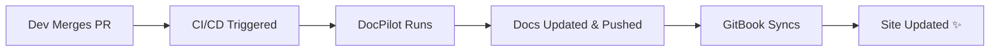

# DocPilot User Guide 🚀

DocPilot is a continuous documentation maintainer that keeps your documentation in sync with your codebase automatically.

## Quick Start

### 1. Installation
```bash
npm install -g docpilot
```

### 2. Initialization
Run the initialization wizard in your project root:
```bash
docpilot init
```
During initialization, you can select:
- **Documentation Types**: PRODUCT, TECHNICAL, CODEBASE, etc.
- **Documentation Format**: **Standard Markdown** or **GitBook**.
- **LLM Provider**: **OpenAI**, **Anthropic**, or **Gemini**.
- **CI/CD Integration**: GitHub Actions or GitLab CI.

### 3. Generate Documentation
To update your documentation based on the latest changes:
```bash
docpilot generate
```
Use the `--dry-run` flag to preview changes without writing them:
```bash
docpilot generate --dry-run
```

## Advanced Features

### GitBook Support
If you select **GitBook** as your format, DocPilot will:
- Automatically maintain a `SUMMARY.md` file in your root.
- Ensure all new documentation files are linked in the navigation sidebar.
- Organize documentation in a `docs/` folder.

### Multi-Provider LLM Support
DocPilot supports multiple AI providers. You can configure them during `init` or override them via CLI:
- **OpenAI**: Requires `OPENAI_API_KEY`.
- **Anthropic**: Requires `ANTHROPIC_API_KEY`.
- **Gemini**: Requires `GEMINI_API_KEY`.

#### CLI Overrides
```bash
docpilot generate --openai-api-key YOUR_KEY
docpilot generate --anthropic-api-key YOUR_KEY
docpilot generate --gemini-api-key YOUR_KEY
```

### CI/CD Integration
DocPilot is designed to run in your CI/CD pipeline. When integrated with GitHub Actions or GitLab CI:
1. Every PR merge triggers DocPilot.
2. DocPilot analyzes the diff.
3. DocPilot updates the relevant documentation files.
4. DocPilot commits and pushes the updates back to the repository.

## The "Stress-Free" Developer Workflow 😌

DocPilot is designed so that developers **never have to manually update documentation**. Once set up, the workflow is entirely automatic.

### 1. The Cycle


### 2. Developer Experience
- **No Manual Commands**: Developers just write code and merge PRs as usual.
- **Always Accurate**: DocPilot analyzes the *actual code changes* and surgically updates the docs.
- **Navigation in Sync**: GitBook's `SUMMARY.md` is updated automatically, so the sidebar is always correct.

### 3. Setting Up "Real" GitBook (The Easiest Way)
To see your docs on a live GitBook site with zero effort:

1.  **Host on GitHub/GitLab**: Push your project to a remote repository.
2.  **Enable GitBook Git Sync**:
    - Go to your Space on [GitBook.com](https://www.gitbook.com).
    - Navigate to **Integrations** → **GitHub** (or GitLab).
    - Select your repository and the **main** branch.
3.  **Configure Secrets**:
    - Add your `OPENAI_API_KEY` (or Gemini/Anthropic) to your repo's **Secrets** (e.g., GitHub Settings → Secrets → Actions).

**That's it!** Every time a PR is merged, your GitBook site will update itself within seconds.
